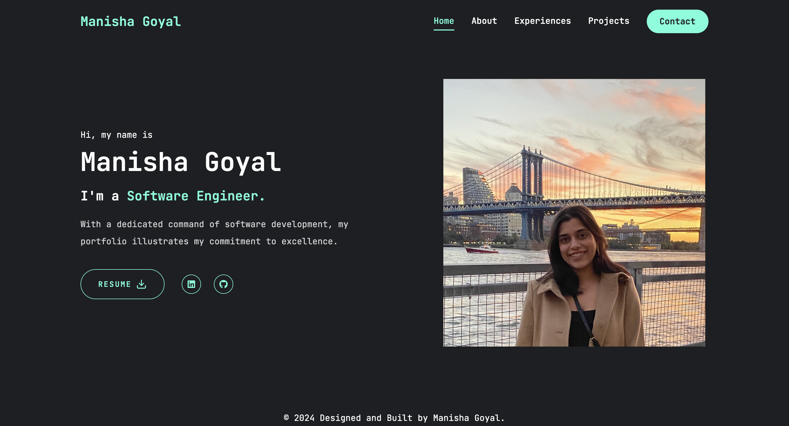

# Manisha Goyal - Developer Portfolio

This repository contains the code of my personal portfolio website showcasing projects, skills, and expertise as a software engineer.



## Features

- Responsive Design: The site adapts to various screen sizes and devices, providing a great user experience on both desktop and mobile.

## Deployment

The portfolio is live and accessible at [manishagoyal.vercel.app](https://manishagoyal.vercel.app/).

## Contributing

Contributions to the portfolio are welcome. To contribute:

1. Fork the repository.
2. Create your feature branch:

   ```bash
   git checkout -b feature/YourFeature
   ```

3. Commit your changes:
   ```bash
   git commit -m 'Add some feature'
   ```
4. Push to the branch:
   ```bash
   git push origin feature/YourFeature
   ```
5. Open a Pull Request.

Please ensure that your contributions align with the project’s purpose and coding standards.

## License

This project is licensed under the MIT License. See the LICENSE file for details.

## Acknowledgements

- Tailwind CSS: Utilized for responsive layout and styling, providing a robust design foundation.

- Framer Motion: Used for animations and transitions to enhance user experience.

- shadcn-ui: Provides UI components that enhance the design and functionality.

- React Icons: Used for incorporating icons throughout the site.

- Inspiration: Various online portfolios and modern web design trends served as design inspiration.
